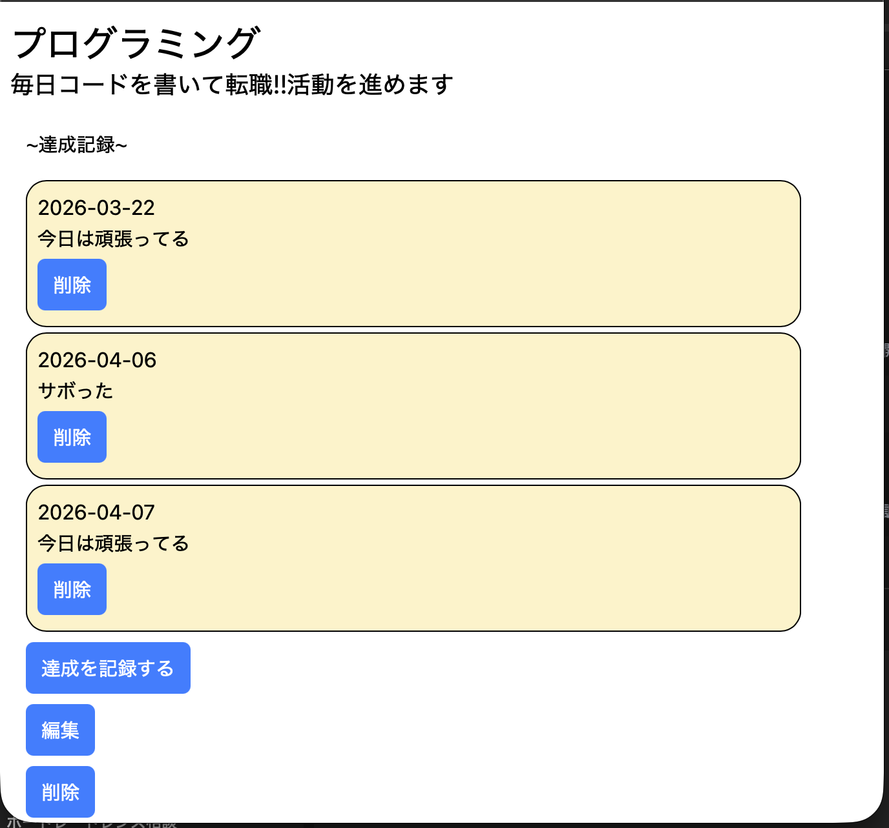
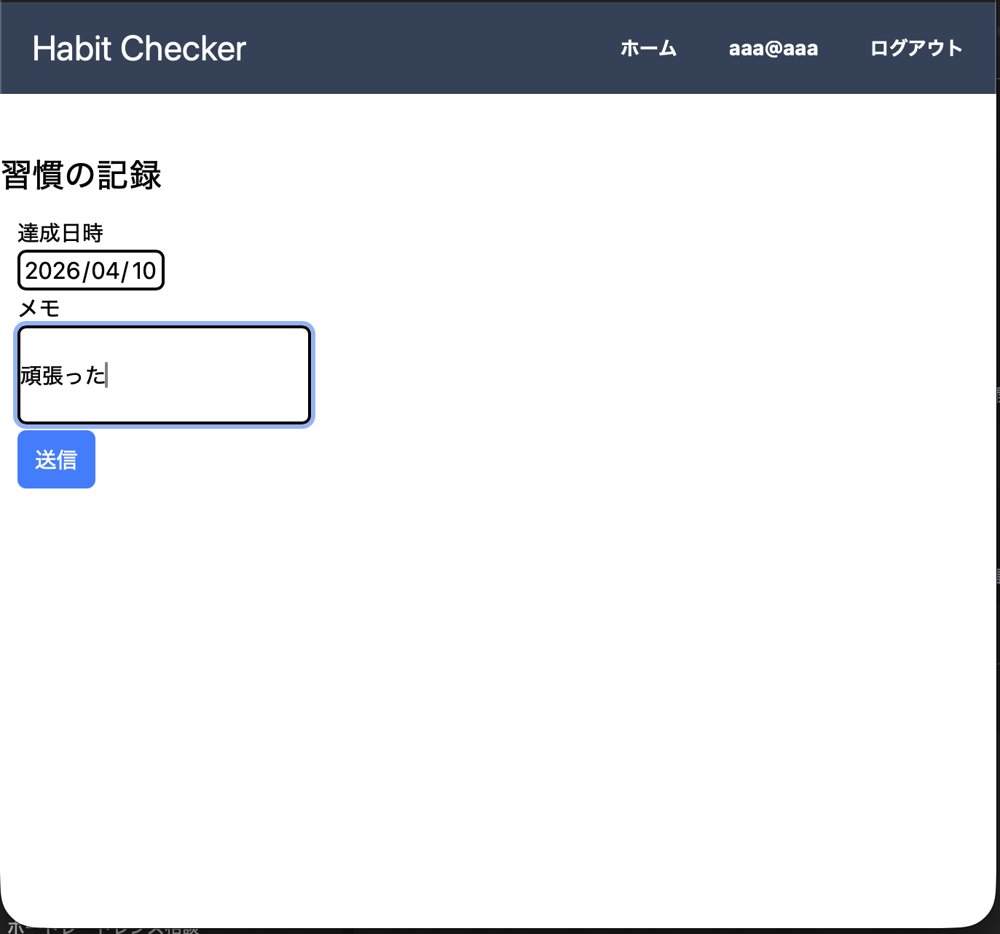
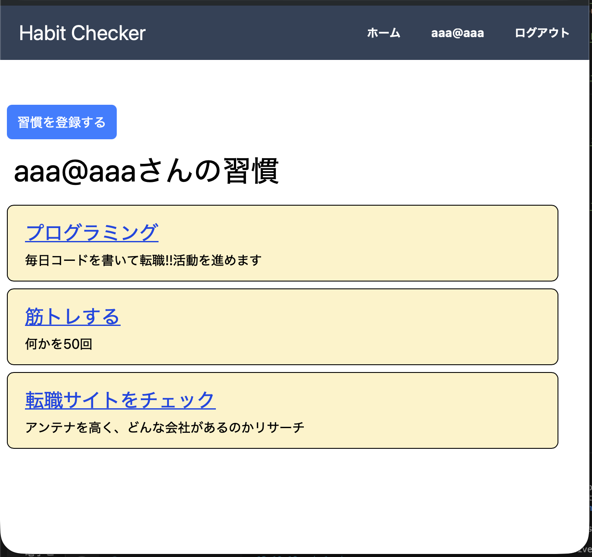

# Habit Checker

習慣の登録と日々の達成記録を行える、シンプルな習慣管理アプリです。  
継続したい行動について、記録を残しやすくすることを目的に開発しました。
また、後述しますが、Railsでのアプリ作成の復習も目標としています。

---

## アプリ概要

Habit Checker は、ユーザーごとに習慣を登録し、各習慣の達成記録を日付とメモ付きで残せる Rails アプリです。  
「まずは迷わず記録できること」を重視し、シンプルにRailsらしさを意識して実装しました。

---

## 制作背景

習慣化したいことがあっても、記録の手間があると続きにくいと感じていました。  
そこで、最低限の操作で習慣登録と達成記録ができるアプリを作成しました。

また、以下の学習も目的としています。

- RailsによるCRUD処理の実装
- Deviseを用いたユーザー認証
- モデル同士の関連付け設計
- PostgreSQLを使ったデータ管理
- tailwindCSSを使った素早いUIの整形

---

## 主な機能

- ユーザー登録 / ログイン
- 習慣の登録・一覧表示
- 習慣ごとの達成記録
- 記録一覧の確認
- 習慣の編集・削除
- 記録メモの保存

---

## 画面イメージ


### 習慣一覧画面
登録した習慣を一覧で確認。



### 達成記録入力画面
日付とメモを添えて、その日の達成内容を記録。



### 習慣詳細・記録一覧画面
習慣ごとの詳細と、過去の達成記録を確認。



---

## 使用技術

- Ruby 3.3.6
- Ruby on Rails 8.0.2
- PostgreSQL
- Devise
- HTML / tailwindCSS 

※ Docker / Kamal についてはリポジトリ内に設定ファイルがありますが、現時点では学習・検証段階です。

---

## データ構成

- User has_many :habits
- Habit belongs_to :user
- Habit has_many :habit_logs
- HabitLog belongs_to :habit

---

## 工夫した点

- ユーザーごとに習慣を管理できるよう、認証機能を導入
- 習慣一覧 → 詳細 → 記録追加、という流れをシンプルに設計
- まずは「継続して使える最小構成」を意識して、機能を絞って実装
- Rails の基本的な CRUD と関連付けを一通り扱える構成にしました

---

## 今後の改善予定

- 達成率の表示
- カレンダー形式での記録確認
- 連続達成日数の表示
- UI / UX の改善
- テストコードの追加
- 本番環境へのデプロイ

---

## ローカルでの起動方法

```bash
git clone https://github.com/o-Ha-minor/habit_checker.git
cd habit_checker
bundle install
bin/rails db:create db:migrate
bin/dev
```

---

## 今後について

今後は、単なる記録だけでなく、「継続しやすさ」や「達成状況の振り返り」ができるアプリへ改善していく予定です.